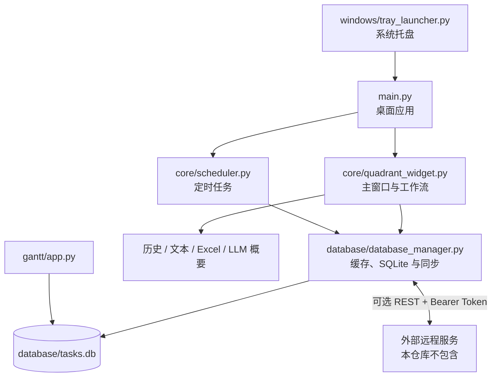

# 四象限任务管理器

一个面向 Windows 的桌面任务管理应用，使用 PyQt6 和
PyQt6-Fluent-Widgets 构建，以四象限工作法组织任务，并提供任务历史、
定时任务、完成/删除归档、导出和可选远程同步。

项目以本地 SQLite 数据库为核心，可以离线运行。远程同步是可选能力，
仓库只包含桌面客户端和 REST 接口约定，不包含远程服务器实现。

## 四象限规则

任务在主窗口中的位置同时表达紧急度和重要度：

| 位置 | 紧急度 | 重要度 | 象限含义 |
|---|---|---|---|
| 右上 | 高 | 高 | 重要且紧急 |
| 左上 | 低 | 高 | 重要不紧急 |
| 右下 | 高 | 低 | 紧急不重要 |
| 左下 | 低 | 低 | 不重要不紧急 |

空间方向是项目的持久化契约：**右侧表示高紧急，上方表示高重要**。
在编辑状态拖动任务后，应用会根据任务位置更新 `urgency` 和
`importance`。

## 功能

### 任务管理

- 创建、编辑和拖动普通任务。
- 支持任务内容、到期日期、备注、目录、紧急度和重要度等字段。
- 双击任务可快速编辑任务内容。
- 右键任务可查看详情，并执行编辑、完成、删除和查看历史等操作。
- 完成和删除均保留历史；删除采用逻辑删除，不会立即物理移除记录。
- 记录任务字段变更历史，并支持分页查看和导出。

### 查看与编辑模式

- 默认处于“正在查看”状态，适合查看任务和打开完成列表。
- 双击主窗口空白处或点击状态按钮可切换到“正在编辑”。
- 编辑状态下可以拖动任务，并显示添加任务、定时任务、导出和设置入口。
- 编辑状态下“完成”按钮会变为“更多”，可打开已完成或已删除任务列表。

### 定时任务与归档

- 创建和管理定时任务，到期时生成普通任务。
- 每日自动刷新时检查应生成的定时任务。
- 已完成和已删除列表支持搜索、分页、跨页选择、批量选择和恢复。
- 恢复后的任务重新进入主任务区域，并保留相关历史信息。

### 导出与扩展

- 导出在办任务或全部任务。
- 导出单个任务的完整变更历史。
- 按时间范围生成任务概要，并导出 Excel。
- 概要生成可调用火山引擎 Ark SDK；未配置 LLM 时，其他功能仍可使用。
- 代码中保留本地 Flask + Frappe Gantt 甘特图实现，但当前主界面的甘特按钮
  默认未启用。该页面依赖浏览器/CDN，不能视为完整的离线功能。

### 本地存储与远程同步

- 普通任务、定时任务和任务历史存储在本地 SQLite 数据库中。
- 数据先更新内存缓存，再由后台线程定期写入数据库。
- 可选 REST 远程同步，支持普通任务和定时任务的上传、下载与删除同步。
- 最近 5 分钟内发生的本地修改优先保留；其他远程差异可由界面逐条确认。
- 网络不可用或未配置远程服务时，应用继续使用本地数据。

## 系统要求

- Windows 10 或 Windows 11。
- Python 3.8 或更高版本。
- 推荐使用 PowerShell 7。
- 托盘窗口置前功能依赖 `pywin32`，该依赖仅在 Windows 安装。

主要 Python 依赖：

- `PyQt6`
- `PyQt6-Fluent-Widgets`
- `requests`
- `pywin32`
- `pandas`
- `openpyxl`
- `Flask`
- `Flask-CORS`
- `volcengine-python-sdk[ark]`

## 安装

### 方法一：使用仓库脚本

安装脚本内部使用相对于 `windows/` 的路径，因此请先进入该目录：

```powershell
Push-Location .\windows
.\setup_first.bat
Pop-Location
```

脚本会在项目根目录创建 `venv`，升级 `pip`，并安装
`requirements.txt` 中的依赖。

### 方法二：手动安装

```powershell
python -m venv venv
& '.\venv\Scripts\Activate.ps1'
python -m pip install --upgrade pip
python -m pip install -r requirements.txt
```

如果 PowerShell 的执行策略不允许运行 `Activate.ps1`，无需激活环境，也可以
直接使用虚拟环境中的 Python：

```powershell
& '.\venv\Scripts\python.exe' -m pip install -r requirements.txt
```

## 启动

所有命令都应从项目根目录执行。

### 直接启动主窗口

```powershell
& '.\venv\Scripts\python.exe' .\main.py
```

这是开发和排查问题时最直接的启动方式。

### 通过系统托盘启动

双击或运行：

```powershell
.\windows\start.bat
```

也可以直接启动托盘包装器：

```powershell
& '.\venv\Scripts\python.exe' .\windows\tray_launcher.py
```

托盘程序会在独立进程中启动 `main.py`。托盘菜单提供“打开”和“退出”，
双击托盘图标也可尝试恢复并置前主窗口。

注意：托盘“退出”当前通过终止子进程关闭主应用。在重要数据修改后，建议先
通过主窗口正常退出，以便执行最终缓存写入和同步清理。

## 基本使用

1. 启动后，在主窗口中查看分布于四个象限的任务。
2. 双击主窗口空白处进入编辑状态。
3. 点击“添加任务”创建任务。
4. 拖动任务到目标象限，表达其紧急度和重要度。
5. 双击任务可快速修改内容；右键任务可打开完整详情与操作入口。
6. 点击“定时任务”管理周期性任务。
7. 在查看状态点击“完成”打开已完成任务；在编辑状态通过“更多”选择完成或
   删除列表。
8. 使用“导出任务”导出在办、全部或概要数据。
9. 使用“设置”调整界面、自动刷新和远程连接配置。

## 数据与配置

### 本地数据库

默认数据库文件为：

```text
database/tasks.db
```

主要数据表包括：

| 表 | 用途 |
|---|---|
| `tasks` | 普通任务、位置、状态和同步标记 |
| `task_history` | 任务字段变更历史 |
| `scheduled_tasks` | 定时任务定义和下次运行时间 |
| `sync_status` | 同步执行记录 |

应用运行时还会使用内存缓存，并默认每 5 秒将脏数据写入 SQLite。请勿在应用
运行时手工修改数据库。

### 应用配置

界面、窗口、任务字段、自动刷新和 LLM 等应用配置位于：

```text
config/config.json
```

远程同步配置位于：

```text
config/remote_config.json
```

配置文件可能包含 API 密钥、访问令牌、用户名或私有服务地址。不要将真实凭据
提交到版本控制、日志、问题报告或截图中。

## 远程同步

远程同步默认不是本地运行的前置条件。启用时，可在应用“设置”的远程配置页
填写启用状态、服务器地址、用户名和访问令牌。

客户端当前使用的主要 REST 路径包括：

```text
GET    /api/health
POST   /api/users
GET    /api/tasks
POST   /api/tasks
DELETE /api/tasks/{task_id}
GET    /api/tasks/{task_id}/history
GET    /api/scheduled_tasks
POST   /api/scheduled_tasks
DELETE /api/scheduled_tasks/{task_id}
```

除公开端点外，请求会在已配置令牌时使用 Bearer Token。服务器需要返回与
`database/database_manager.py` 中客户端解析逻辑兼容的数据结构。

本仓库不提供远程服务器、服务端数据库、部署脚本或生产环境认证方案。因此，
README 不对服务端技术栈、存储方式、多用户隔离或备份策略作任何保证。

## 可选 LLM 概要

“导出概要”可以根据时间范围查询任务，并调用 Ark SDK 生成结构化概要后导出
Excel。使用前需要在 `config/config.json` 的 `LLM_CONFIG` 中提供兼容配置。

请只在本地配置真实凭据，不要把密钥写入 README、测试样例或提交记录。LLM
调用失败不会影响普通任务管理、历史查看或常规导出。

## 项目结构

```text
task_manage/
├─ main.py                    # 桌面应用入口
├─ requirements.txt           # Python 运行依赖
├─ config/                    # 应用配置和远程同步配置
├─ core/                      # 主窗口、任务控件、定时任务、归档和导出
├─ database/                  # SQLite、缓存、历史、同步和维护脚本
├─ ui/                        # 样式、通知、Fluent 兼容和共享 UI 组件
├─ windows/                   # Windows 托盘和安装/启动脚本
├─ gantt/                     # 可选 Flask/Frappe Gantt 页面
├─ icons/                     # 应用图标资源
├─ tests/                     # unittest 回归测试
└─ docs/
   ├─ AI_PROJECT_MAP.md       # 面向维护者的项目地图入口
   └─ ai-project-map/         # 按子系统拆分的架构与风险说明
```

更详细的模块职责、调用链、数据库结构、同步规则和测试归属，请从
[`docs/AI_PROJECT_MAP.md`](docs/AI_PROJECT_MAP.md) 开始按需阅读。

## 架构概览



桌面业务统一通过 `database.get_db_manager()` 访问数据。甘特图为现有例外，
会通过独立只读连接查询 SQLite。

## 开发与测试

项目测试使用 `unittest`。运行完整测试：

```powershell
& '.\venv\Scripts\python.exe' -m unittest discover -s tests -v
```

运行单个测试模块：

```powershell
& '.\venv\Scripts\python.exe' -m unittest tests.test_module_name -v
```

部分 PyQt 测试会在代码中配置 offscreen 平台。涉及窗口布局、拖动、托盘、
弹窗或视觉效果的改动，除了运行测试外，还应执行针对性的 Windows UI 检查。

项目地图记录的 2026 年 6 月 10 日测试基线并非全绿：
`tests.test_database_manager_remote` 有 8 个既有错误。后续修改应区分既有基线
问题与本次变更引入的回归，不能仅凭完整测试退出码判断归因。

## 已知边界

- 项目面向 Windows；其他平台可以尝试直接运行 `main.py`，但托盘置前和批处理
  脚本不保证可用。
- 仓库不包含远程服务器实现。
- 甘特图依赖本地 Flask 服务及页面中的外部 CDN。
- `PyQt6.QtWebEngineWidgets` 是甘特图内嵌显示的可选依赖；缺少时会回退到系统
  浏览器。
- 定时任务、同步、LLM 和甘特图涉及时间、网络或第三方服务，使用前应按实际
  环境验证。
- 日志写入 `logs/`，数据库、日志、缓存和备份均属于运行时文件，不应作为源码
  提交。

## 文档维护

README 面向使用者和首次参与开发的维护者，只保留稳定、可操作的项目说明。
如果目录、入口、依赖、数据库 schema、配置契约、同步协议、关键运行流程或测试
归属发生变化，应同时更新对应的 `docs/ai-project-map/` 分卷；只有当阅读路由
或分卷范围变化时，才需要更新 `docs/AI_PROJECT_MAP.md`。
