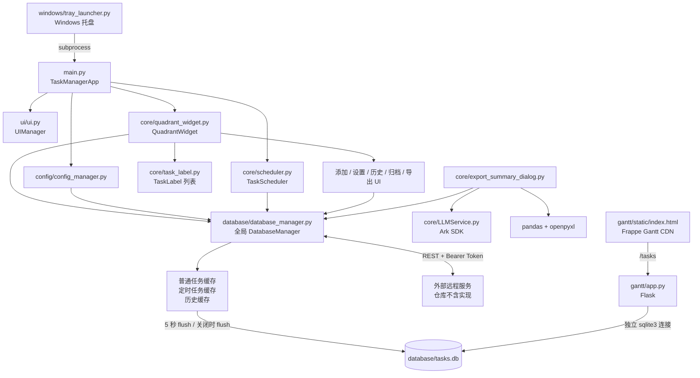

# 架构、目录与模块边界

> [返回 AI 项目地图总目录](../AI_PROJECT_MAP.md)
>
> **阅读范围：** 用于理解项目定位、真实目录、入口、总体依赖和耦合热点。
>
> **相关分卷：** 运行流程见 [02](02-desktop-task-flow.md)；数据层见 [03](03-database-sync.md)。
## 元数据、范围与可信度

| 项目 | 值 |
|---|---|
| 仓库根目录 | `C:\Users\liang\Documents\solutions\task_manage` |
| 分析日期 | 2026-06-10（Asia/Shanghai） |
| Git 分支 | `main` |
| 基线提交 | `59e5548824158500856516d0dda86a3db2a7a948`，`fix:修复连续点击右键详情后再删除，会关不掉详情界面的bug` |
| 工作树状态 | 分析时 `AGENTS.md` 为未跟踪文件；本地图创建前不存在 |
| 分析方法 | 实际读取源码、配置键结构、依赖清单、启动脚本、HTML、测试方法与 Git 元数据；未仅依赖 README |
| 排除范围 | `.git/`、`venv/`、`.tmp-tests/`、`.worktrees/`、`node_modules/`、`__pycache__/`、`.pytest_cache/`、日志、SQLite 二进制、备份及其他生成物 |
| 敏感信息处理 | 只记录配置键名与用途；未复制 `api_key`、`api_token`、用户名或任何实际服务地址 |
| 验证性质 | 静态分析。未启动 GUI、远程服务、甘特服务，未读取或修改数据库内容 |

### 可信度分级

- **高**：入口、模块 import、SQLite DDL、缓存/flush、坐标规则、任务生命周期、远程端点、分页 SQL、测试文件覆盖，均由当前源码直接确认。
- **中高**：运行时线程交互、远程冲突 UX、窗口行为，由源码与测试共同确认，但未连接真实远端或执行 GUI。
- **中**：Windows 托盘置前、Fluent 第三方内部 monkey patch、Frappe Gantt 浏览器表现，依赖操作系统和第三方版本，未做运行态验证。
- **低或未知**：远程服务器真实实现、线上响应兼容性、当前数据库数据质量、真实凭据有效性；仓库不含服务器实现，且数据库和敏感值被有意排除。

## 项目概览

这是一个 Windows 优先的 Python 桌面四象限任务管理器：

- 主界面基于 `PyQt6`，视觉组件主要基于 `PyQt6-Fluent-Widgets`。
- `main.py` 创建 `QApplication`、`QuadrantWidget`、`TaskScheduler` 和每日自动刷新定时器。
- `core/quadrant_widget.py` 是 UI 与业务工作流总协调器。
- `database/database_manager.py` 是 SQLite、本地内存缓存、历史、延迟落盘和远程同步的核心。
- 普通任务以空间坐标表示紧急度/重要度；右侧为高紧急，上方为高重要。
- “归档”不是独立数据库状态，而是 UI 对“已完成”和“已逻辑删除”两类集合的统称。
- 定时任务保存在独立表中，到期时生成普通任务。
- 甘特图是可选的本地 Flask 页面，直接读取 SQLite。
- 概要导出可调用火山引擎 Ark SDK 的 LLM，再通过 pandas/openpyxl 输出 Excel。

## 真实目录树

以下为分析时实际存在且与源码/契约相关的树；已排除用户指定目录和二进制/缓存内容。

```text
task_manage/
├─ AGENTS.md                         # 仓库级 AI 规则；分析时未跟踪
├─ README.md                         # 当前安装、使用、功能边界与开发入口
├─ main.py                           # 桌面应用直接入口
├─ font_families.py                  # Qt/QSS/Web 字体栈常量
├─ requirements.txt                  # Python 运行依赖
├─ package.json                      # 声明 frappe-gantt npm 依赖
├─ package-lock.json
├─ __init__.py
├─ config/
│  ├─ __init__.py
│  ├─ config_manager.py              # 应用配置与任务保存/加载适配层
│  ├─ remote_config.py               # 远程配置读写、测试连接、CLI
│  ├─ config.json                    # 当前工作树应用配置；可能含明文 LLM 凭据
│  └─ remote_config.json             # 当前工作树远程配置；可能含明文敏感值
├─ core/
│  ├─ __init__.py
│  ├─ quadrant_widget.py             # 主窗口和总工作流
│  ├─ task_label.py                  # 单任务控件、详情、编辑、完成、删除
│  ├─ add_task_dialog.py             # 普通任务动态字段表单
│  ├─ settings_dialog.py             # 视觉、自动刷新、远程配置编辑
│  ├─ archive_table.py               # 已完成/已删除共享分页表格基类
│  ├─ complete_table.py              # 已完成任务特化
│  ├─ deleted_table.py               # 已删除任务特化
│  ├─ history_viewer.py              # 单任务历史分页与导出
│  ├─ scheduler.py                   # 定时任务计算、生成和管理 UI
│  ├─ export_summary_dialog.py        # 时间区间查询、LLM 概要、Excel 导出
│  ├─ LLMService.py                  # Ark LLM 客户端单例与 JSON 解析
│  ├─ color_utils.py                 # 象限颜色随机扰动
│  └─ utils.py                       # 日志初始化与全局异常处理
├─ database/
│  ├─ __init__.py
│  ├─ database_manager.py            # SQLite、缓存、历史、flush、远程同步
│  ├─ sync_manual.py                 # 手工同步/备份 CLI；存在导入路径风险
│  ├─ migrate_priority_to_urgency_importance.py
│  ├─ deduplicate_tasks.py           # 数据库去重维护脚本
│  └─ delete_test_tasks.py           # 物理删除标题含 test 的维护脚本
├─ ui/
│  ├─ __init__.py                    # 公共 UI 导出
│  ├─ ui.py                          # UIManager 与颜色对话框包装
│  ├─ styles.py                      # 按钮 token、共享 QSS、StyleManager
│  ├─ fluent.py                      # Fluent 组件兼容层和日期选择器补丁
│  ├─ scrollbar.py                   # Fluent 滚动条全局安装和 fallback
│  ├─ adaptive_table.py              # 多行文本自适应表格
│  ├─ degree_badges.py               # 紧急度/重要度/状态徽标
│  └─ notifications.py               # InfoBar 与 QMessageBox 回退
├─ gantt/
│  ├─ app.py                         # Flask/CORS 服务，直接读 SQLite
│  └─ static/index.html              # CDN 加载 Frappe Gantt 的只读页面
├─ windows/
│  ├─ tray_launcher.py               # Windows 托盘入口，子进程启动 main.py
│  ├─ start.bat                      # 激活 venv 后启动托盘
│  └─ setup_first.bat                # 创建 venv 并安装 requirements
├─ icons/
│  ├─ app_icon.ico
│  ├─ app_icon.png
│  ├─ check.png
│  └─ down_arrow.png
├─ tests/
│  ├─ test_database_manager_remote.py
│  ├─ test_database_manager_history_sync.py
│  ├─ test_archive_task_panels.py
│  ├─ test_history_viewer_table_layout.py
│  ├─ test_settings_dialog.py
│  ├─ test_urgency_importance_ui.py
│  ├─ test_task_label_shadow.py
│  ├─ test_fluent_date_picker_migration.py
│  ├─ test_notifications.py
│  ├─ test_panel_form_styles.py
│  ├─ test_remove_drop_shadow.py
│  └─ test_ui_dialog_transparency.py
└─ docs/superpowers/
   ├─ specs/                          # 历史 UI/同步/分页设计依据
   └─ plans/                          # 对应实施计划，不能替代当前源码
```

运行时还存在 `database/tasks.db`、根目录数据库备份、`logs/` 等生成物；它们不是源码，本次未读取。

## 根目录与入口职责

| 文件 | 职责 | 关键依赖/调用者 |
|---|---|---|
| `main.py` | `TaskManagerApp` 生命周期；加载配置；创建主窗口；注册 `UIManager`；每分钟检查每日刷新时刻；触发定时任务生成；进入 Qt 事件循环 | 调用 `load_config()`、`QuadrantWidget`、`TaskScheduler`、全局 Fluent 滚动条 |
| `font_families.py` | 集中定义 Qt 字体、QSS 字体栈和 Web 字体栈 | `ui/styles.py`、`ui/degree_badges.py`、`config/config_manager.py` |
| `__init__.py` | 空包标识 | 无运行逻辑 |

## 总体架构



## 模块依赖关系

### 主依赖方向

```text
main
  -> config.config_manager
  -> core.quadrant_widget
  -> core.scheduler
  -> ui.ui / ui.scrollbar / ui.notifications

core.quadrant_widget
  -> task_label / add_task_dialog / settings_dialog
  -> archive complete/deleted dialogs
  -> scheduler / export_summary_dialog / gantt
  -> config managers
  -> database.get_db_manager
  -> ui styles/notifications/scrollbar

core.task_label
  -> add_task_dialog / history_viewer
  -> config.load_config
  -> database.get_db_manager（删除时延迟导入）
  -> ui styles/notifications/badges/color dialog

database.database_manager
  -> sqlite3 / requests / threading
  -> 配置文件 JSON（在单例创建时读取）
  -X-> 不应依赖 core 或具体 UI；仅通过 listener 回调通知
```

### 耦合热点

1. `core/quadrant_widget.py`：UI、配置、同步冲突、导出和任务列表集中于一处。
2. `database/database_manager.py`：缓存、SQL、同步、冲突、线程和 API 协议集中于一处。
3. `config/config_manager.py`：名字是配置管理，但同时承担任务坐标语义和任务持久化适配。
4. `core/export_summary_dialog.py`：UI、SQL、线程池、提示词、LLM 和 Excel 集中于一处。
