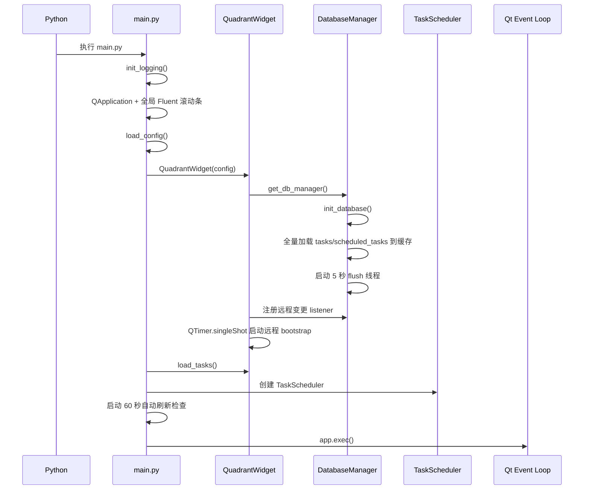

# 桌面启动、主界面与任务流程

> [返回 AI 项目地图总目录](../AI_PROJECT_MAP.md)
>
> **阅读范围：** 用于修改启动、托盘、QuadrantWidget、TaskLabel、任务创建/编辑/移动/完成/删除和象限坐标语义。
>
> **相关分卷：** 持久化与同步见 [03](03-database-sync.md)；归档与历史 UI 见 [04](04-scheduler-archive.md)。
## `core/` 业务窗口职责

| 文件 | 职责 | 关键接口/状态 |
|---|---|---|
| `core/quadrant_widget.py` | 主窗口、四象限绘制、控制面板、任务创建/加载/保存、设置预览与提交、导出、甘特入口、归档入口、远程冲突确认、关闭清理 | `tasks` 为当前可见 `TaskLabel` 列表；监听 DB 同步事件；是 UI 层最强耦合点 |
| `core/task_label.py` | 单任务标签；复选框完成状态；拖拽；到期样式；右键详情；编辑、改色、打开目录、历史、删除 | `statusChanged` 驱动保存；`deleteRequested` 驱动主窗口移除；删除前直接调用 DB 逻辑删除 |
| `core/add_task_dialog.py` | 按配置动态构造普通任务字段；支持 text/date/select/multiline/file；紧急度和重要度同排 | 使用 `ui.fluent` 日期控件和 `ui.styles` |
| `core/settings_dialog.py` | 颜色、透明度、尺寸、圆角、自动刷新、远程开关/地址/用户/令牌编辑；发出实时预览 | 数值归一化和边界保护；提交结果分为 `config` 与 `remote_config` |
| `core/archive_table.py` | 已归档集合共享 UI：50 条分页、500ms 搜索防抖、跨未加载页全选、批量还原 | 通过类属性注入 DB 方法名，供完成/删除两个子类复用 |
| `core/complete_table.py` | 把共享归档表映射到“已完成且未删除”；还原会清除完成状态 | DB 方法：`load/count/ids_completed_tasks`、`restore_completed_task` |
| `core/deleted_table.py` | 把共享归档表映射到“逻辑删除”；日期列取 `updated_at`；还原仅清除删除状态 | DB 方法：`load/count/ids_deleted_tasks`、`restore_deleted_task` |
| `core/history_viewer.py` | 单任务历史 50 条分页、合并各字段历史、表格展示；导出时读取完整历史 | 页面 SQL 倒序；导出 Excel/CSV 时重新调用非分页 `get_task_history()` |
| `core/scheduler.py` | 周期计算；扫描到期定时任务并生成普通任务；定时任务列表、创建和逻辑删除 UI | `TaskScheduler.calculate_next_run_time()`；`check_and_spawn_scheduled_tasks()` |
| `core/export_summary_dialog.py` | 按时间区间从 SQLite 查询有历史的任务；后台线程池逐任务调用 LLM；导出 Excel | `SummaryWorker` 是 `QThread`，内部最多 10 个 worker；直接使用 DB 连接 |
| `core/LLMService.py` | 读取 `LLM_CONFIG`；建立 Ark 异步客户端；JSON Schema 响应、重试、同步包装、JSON 解析 | 全局单例；每次同步调用创建独立 asyncio loop，但共享异步客户端 |
| `core/color_utils.py` | 将象限基础色转 HSV，在配置范围内随机扰动后返回标签色 | 新任务创建时由 `QuadrantWidget` 调用 |
| `core/utils.py` | 创建 UTF-8 轮转日志 `logs/app.log`；注册全局未捕获异常处理 | 5MB、3 个备份 |
| `core/__init__.py` | 包标识 | 无业务逻辑 |

## `windows/` 与可选平台职责

| 文件 | 职责 | 重要事实 |
|---|---|---|
| `gantt/app.py` | `GET /tasks` 读取 SQLite；过滤 deleted 和 completed；映射为 Frappe Gantt JSON；`GET /` 返回静态页 | 不使用 `get_db_manager()`；独立连接直读 DB |
| `gantt/static/index.html` | 从 `/tasks` 拉取数据；只读 Gantt；日/周/月/年视图；展示 notes | JS/CSS 实际从公共 CDN 获取，未使用仓库 `node_modules` |
| `windows/tray_launcher.py` | 托盘菜单；用 `pythonw.exe` 子进程启动 `main.py`；枚举 Python 进程和 Win32 窗口置前；退出子进程 | Windows/pywin32 专用；窗口识别使用启发式 |
| `windows/start.bat` | 从 `windows/` 切换并激活 `../venv`，启动 `tray_launcher.py` | 源文件当前显示为疑似编码损坏文本 |
| `windows/setup_first.bat` | 创建 `../venv`、升级 pip、从镜像安装 requirements | 同样存在疑似编码损坏 |

## 启动与关闭流程

### 直接入口



### 托盘入口

1. `windows/start.bat` 激活 `venv`，启动 `windows/tray_launcher.py`。
2. 托盘进程创建 `QSystemTrayIcon`。
3. `TaskManagerTray.start_app()` 选择 `pythonw.exe`，以仓库根为 `cwd` 启动 `main.py`。
4. “打开”通过枚举 Python 进程和 Win32 窗口尝试恢复/置前。
5. “退出”先 `terminate()` 子进程，超时后 `kill()`，再退出托盘。

### 正常关闭

`QuadrantWidget.closeEvent()`：

1. 标记 `_is_closing`。
2. 保存窗口/控制面板配置。
3. 移除远程 listener。
4. flush 本地缓存。
5. 若启用远程，执行普通任务上传，再次 flush。
6. `close_connection()`；该方法再次 flush、关闭连接、停止同步线程和 flush 线程。
7. 请求 `QApplication.quit()`。

托盘强制 `terminate/kill` 可能绕过上述 Qt 正常关闭路径，这是数据落盘风险点。

## 普通任务生命周期与数据流

### 创建

1. 编辑模式下点击“添加”或双击空白区域。
2. `QuadrantWidget.create_task_at_position()` 用 `config.task_fields` 创建 `AddTaskDialog`。
3. 根据点击坐标选象限，并由 `ColorUtils` 在象限颜色范围内生成随机色。
4. 创建 `TaskLabel`，位置设为点击坐标减去约半个标签尺寸。
5. `QuadrantWidget.save_tasks()` -> `config.config_manager.save_tasks()`。
6. `save_tasks()` 按标签当前坐标重算 urgency/importance。
7. `DatabaseManager.save_task()` 先追加字段历史，再写内存缓存并标记 `modified`。
8. 最多约 5 秒后 flush 到 SQLite；关闭、分页查询、导出或显式操作也会提前 flush。

### 编辑与拖动

- 编辑表单修改属性后发出 `TaskLabel.statusChanged`。
- 拖动释放也发出同一信号。
- 主窗口只保存触发信号的任务时，仍会根据窗口中心重算 urgency/importance。
- 位置字段不写入 `task_history`，避免高频拖动产生历史。

### 完成与取消完成

- 复选框勾选：`completed=True`，`completed_date=今天`，立即触发保存。
- 取消勾选：`completed=False`，`completed_date=''`。
- 主面板加载规则：未删除任务中，所有未完成任务 + “今天完成”的任务可见。
- 今天以前完成的任务从主面板隐藏，但在“已完成任务”对话框可见。
- `restore_completed_task()` 清除完成状态和完成日期，并标记待同步。

### 删除与还原

- 任务详情“删除”调用 `DatabaseManager.delete_task()`，把 `deleted=True`，保留记录和历史。
- 随后 `deleteRequested` 使主窗口移除控件。
- 已删除列表包含完成和未完成任务，排序按 `updated_at DESC, created_at DESC`。
- `restore_deleted_task()` 只清除 `deleted`，保留删除前的 `completed/completed_date`：
  - 原未完成任务还原后回主面板。
  - 原已完成任务还原后回已完成列表，除非恰为今天完成。

### 历史

- 可配置字段值发生变化时写 `task_history`。
- action 实际使用 `create` 或 `update`；完成/删除本身不是独立历史 action，因为 `completed`/`deleted` 不在默认字段列表中。
- UI 读取单任务历史时按时间倒序分页，每页 50 条。
- 导出历史会读取全量本地历史，不受当前已加载页限制。

## 坐标到 urgency/importance 的规则

### 当前持久化规则

规则位于 `config/config_manager.py::save_tasks()`，以主窗口中心为基准，使用 `TaskLabel.pos()` 的**左上角坐标**：

```text
center_x = parent.width() // 2
center_y = parent.height() // 2

urgency  = "高" if position_x > center_x else "低"
importance = "高" if position_y < center_y else "低"
```

| 空间 | urgency | importance | 象限 |
|---|---|---|---|
| 右上 | 高 | 高 | q1 |
| 左上 | 低 | 高 | q2 |
| 右下 | 高 | 低 | q3 |
| 左下 | 低 | 低 | q4 |

### 创建时象限规则

`QuadrantWidget.get_quadrant_at_position()` 使用点击点：

- `x >= center_x, y < center_y` -> q1
- `x < center_x, y < center_y` -> q2
- `x >= center_x, y >= center_y` -> q3
- 其余 -> q4

### 必须保留的契约与已知偏差

- 契约：**右 = 高紧急，上 = 高重要**。
- 创建判定对垂直中心线使用 `>=`，保存判定使用 `>`，恰好在中心线时有一像素级差异。
- 创建时按点击点判象限，随后标签移动到 `click - (75, 40)`，保存时按标签左上角判定；靠近中心线创建时，颜色象限与最终 urgency/importance 可能不一致。
- 修改标签尺寸、拖动边界、窗口缩放、坐标迁移时，必须决定是继续用左上角，还是迁移到标签中心点，并补数据迁移与测试。
