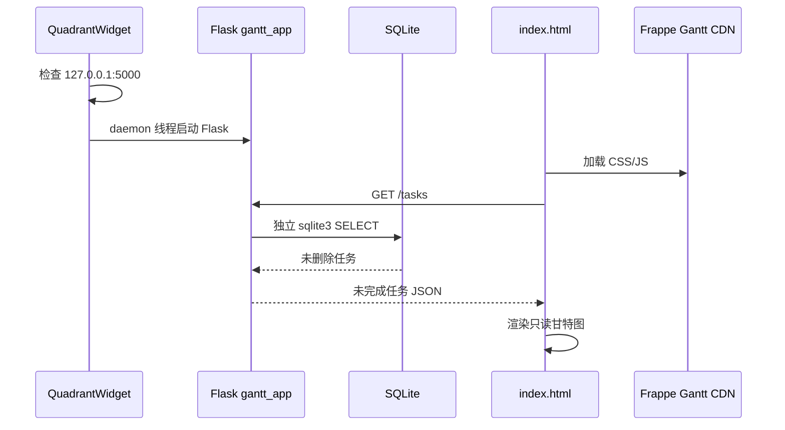

# 导出、LLM 与甘特图

> [返回 AI 项目地图总目录](../AI_PROJECT_MAP.md)
>
> **阅读范围：** 用于修改任务导出、历史导出、AI 概要、Ark SDK、Excel、Flask 和 Frappe Gantt。
>
> **相关分卷：** 数据新鲜度与连接约束见 [03](03-database-sync.md)；依赖和测试缺口见 [07](07-dependencies-tests.md)。
## 导出与 LLM

### 导出在办

`QuadrantWidget.export_unfinished_tasks()` 只遍历当前主面板控件，因此包括当前可见未完成任务，输出 UTF-8 文本。

### 导出所有

- `DatabaseManager.load_tasks(all_tasks=True)` 返回缓存中所有普通任务，包括完成和删除。
- pandas 输出 Excel。
- 当前列仍偏旧：包含 `priority`，未导出 urgency/importance。
- 代码会把第一条完整任务字典写入 INFO 日志；若任务 notes/directory 含敏感信息，可能造成日志泄露。

### 历史导出

- `HistoryViewer` 可输出 `.xlsx` 或 `.csv`。
- 使用 pandas；Excel 依赖 openpyxl。
- 导出读取完整本地历史，不调用远程历史。

### AI 概要

1. 用户选择日期区间。
2. flush 后，查询该区间内有 `task_history` 的任务 ID。
3. 查询任务详情与区间历史。
4. 若 LLM 不可用，仍返回基础数据并写占位 summary。
5. 若可用，最多 10 线程并行，每个任务要求 JSON Schema `{task_id, summary}`。
6. 单请求连接/超时错误最多重试 2 次，退避 1 秒、2 秒。
7. 输出 Excel，包含任务基础字段和 summary。

已知问题：

- SQL 读取历史后存入的键是中文 `任务名称/任务详情/修改动作/时间`，但提示词构造读取 `action/timestamp/field/value`，当前会得到空值，LLM 看不到正确历史语义。
- 同一个 `AsyncArk` 客户端由多个线程、多个新事件循环共享，第三方客户端是否线程/事件循环安全需要验证。
- 配置文件中 LLM 密钥为明文风险。

## 甘特图

### 数据路径

### 映射规则

- start：`create_date`，无法解析则今天。
- end：`due_date`，空或非法则 start +3 天。
- completed 任务在服务端循环中被跳过。
- deleted 在 SQL 中过滤。
- name：`text`，空则 ID。
- notes、color 原样提供。
- 页面 readonly，按钮只切换日/周/月/年视图。

### 当前状态与风险

- 主控制面板中的甘特按钮已注释，功能代码仍保留，通常没有可见入口。
- Flask 直接读 SQLite，不经过缓存；最近 5 秒内未 flush 的变更可能不可见。
- `DB_PATH` 读取发生在 `gantt.app` import 时；`QuadrantWidget` 后续修改环境变量并不会更新已绑定常量。
- `package.json` 的本地 `frappe-gantt` 依赖未被页面使用；页面依赖公共 CDN，离线不可用。
- CORS 对服务全开；服务仅绑定 loopback，风险较低但仍应避免扩大监听地址。
